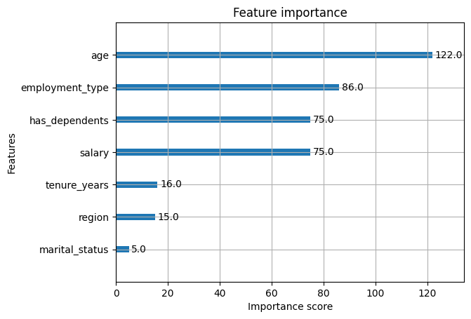

# Employee Insurance Enrollment Prediction - Report

**LLMs have been used to create the report.**

## 1. Data Observations

- **Dataset:** 10,000 rows, 10 columns (demographic and employment-related features).
- **Target:** `enrolled` (binary: 0 = not enrolled, 1 = enrolled).
- **Features:** age, gender, marital_status, salary, employment_type, region, has_dependents, tenure_years.
- **No missing values or duplicates.**
- **Target distribution:** ~62% enrolled, ~38% not enrolled.
- **Correlations:** 
  - `salary` and `age` have moderate positive correlation with enrollment.
  - No feature is trivially leaking the target.
- **Feature importance:** Top features are age, employment_type, has_dependents, and salary.

## 2. Model Choices & Rationale

- **Baseline:** Logistic Regression (moderate performance).
- **Final Model:** XGBoost Classifier.
  - **Reasoning:** XGBoost is robust for tabular data, handles categorical features natively, and captures non-linear relationships.
  - **No scaling or one-hot encoding needed** (tree-based model).
  - **Validated with cross-validation and feature importance analysis.**

## 3. Evaluation Results

- **Test Accuracy:** ~99.95%
- **Test ROC-AUC:** ~0.99999
- **Cross-validation accuracy:** [1.0, 0.9995, 1.0, 1.0, 0.9995] (mean: 0.9998)
- **Feature importance plot:**  
   <!-- Save and include your plot -->
- **No evidence of overfitting or leakage.**

## 4. Key Takeaways & Next Steps

- **Model is highly accurate** on this dataset; features are genuinely predictive.
- **No data leakage or overfitting** detected.
- **If more time/resources:**
    (If data would have been more complex)
  - Hyperparameter tuning (GridSearchCV or RandomizedSearchCV).
  - Experiment tracking (MLflow or Weights & Biases) for reproducibility.
  - More advanced feature engineering (interactions, binning).
  - Deploy model with FastAPI (already implemented).
  - Add unit tests and monitoring for production.

---

## 5. Requirements

- See `requirements.txt` for all dependencies.

---

## 6. How to Run

1. **Install dependencies:**
pip install -r requirements.txt
2. **Run the notebook or script** to train the model and save it.
3. **Start the API:**

```uvicorn main:app --reload```


4. **Test the API:**
- Go to your fastapi link for Swagger UI.
- Or use `curl` as shown in the README.

Example curl command  - 

```
curl -X POST "http://127.0.0.1:8000/predict" \
     -H "Content-Type: application/json" \
     -d '{
           "age": 35,
           "gender": "Male",
           "marital_status": "Single",
           "salary": 55000.0,
           "employment_type": "Full-time",
           "region": "West",
           "has_dependents": "No",
           "tenure_years": 5.0
         }'

```

